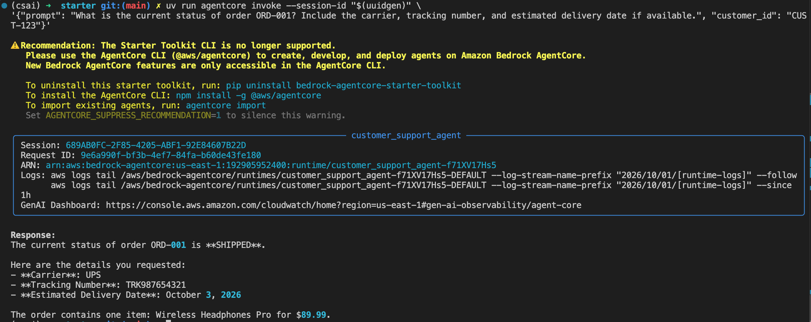
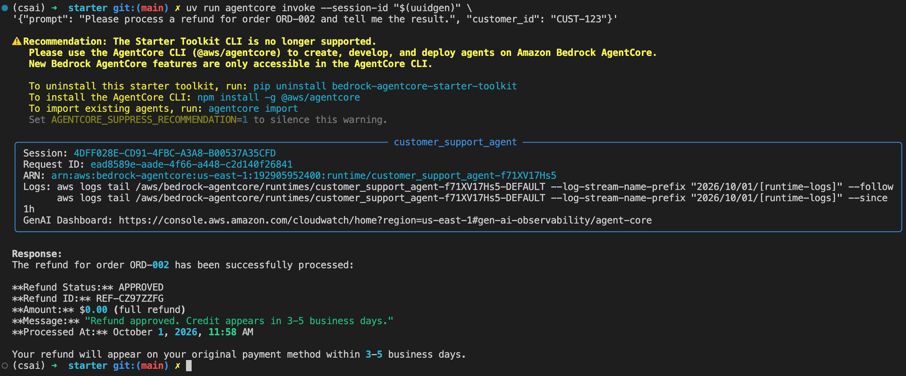
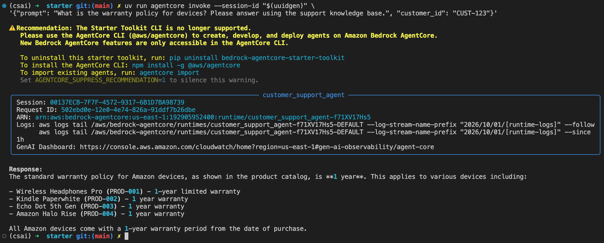
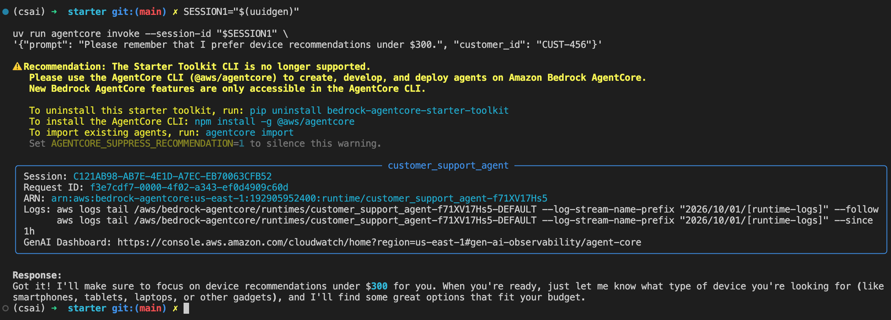
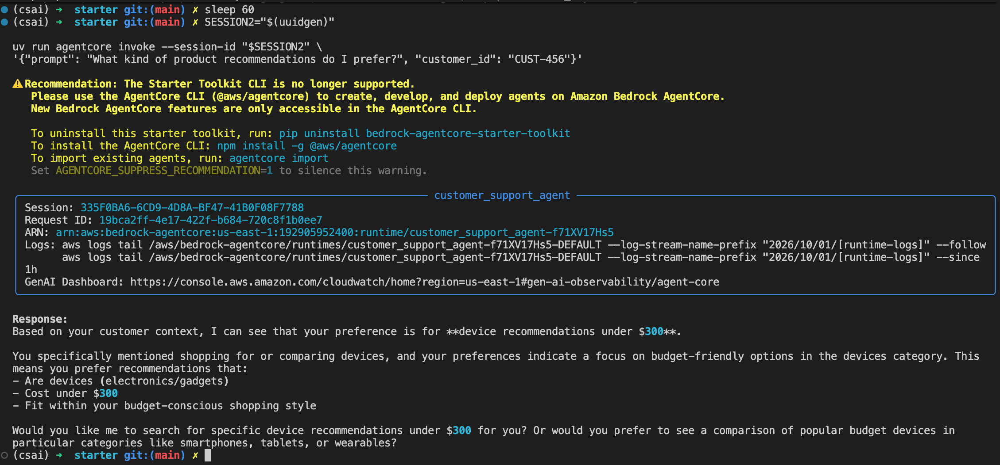
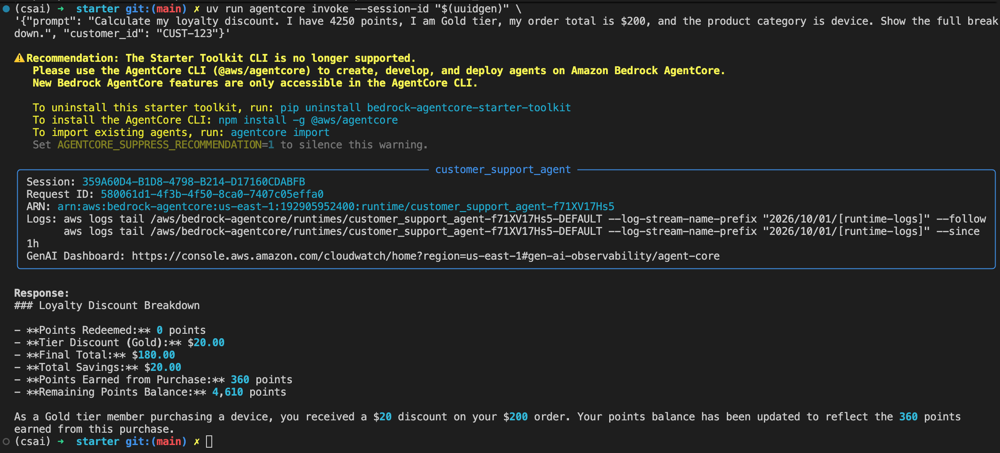
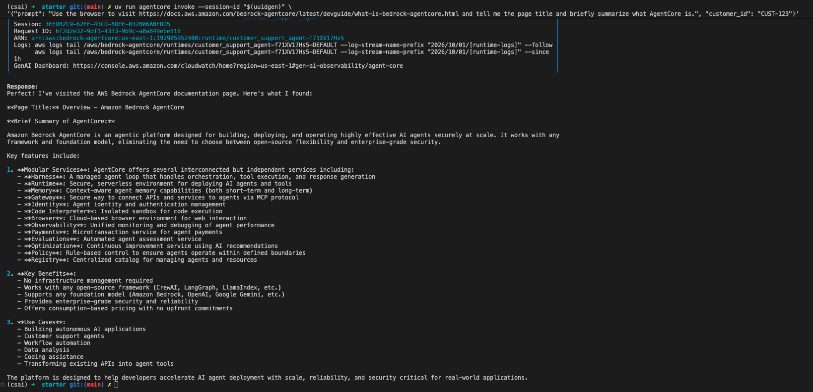
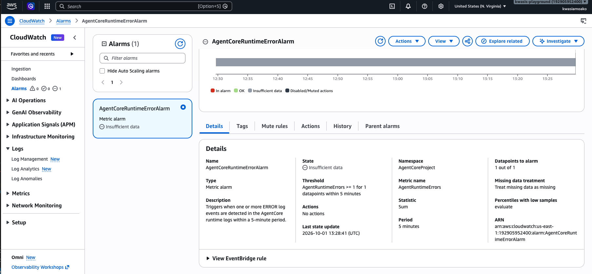

# Project 2 — Evidence

This document contains evidence for the six required project tests per the Project Rubric.

## Test 1 — Order Tracking

Prompt:
> What is the current status of order ORD-001? Include the carrier,
> tracking number, and estimated delivery date if available.

---

## Test 2 — Refund Processing

Prompt:
> Please process a refund for order ORD-002 and tell me the result.

---

## Test 3 — Knowledge Base / RAG

Prompt:
> What is the warranty policy for devices? Please answer using the
> support knowledge base.

---

## Test 4 — Long-Term Memory

Session 1:
> Please remember that I prefer device recommendations under $300.

Session 2:
> What kind of product recommendations do I prefer?

The two prompts were run under different session IDs using the same customer ID.

---

## Test 5 — Loyalty Discount

Prompt:
> Calculate my loyalty discount. I have 4250 points, I am Gold tier,
> my order total is $200, and the product category is device.
> Show the full breakdown.

---

## Test 6 — Browser Tool

Prompt:
> Use the browser to visit the AWS Bedrock AgentCore documentation
> and tell me the page title and briefly summarize what AgentCore is.

---

## CloudWatch Alarm

A CloudWatch metric filter and alarm were configured for the AgentCore runtime logs.

- Metric namespace: `AgentCoreProject`
- Metric: `AgentRuntimeErrors`
- Threshold: `>= 1`
- Period: `5 minutes`
- Datapoints to alarm: `1 out of 1`

The alarm is designed to flag runtime `ERROR` log events.

---

## Reflection

For this project, I followed the recommended architecture from the course sessions and project runbook as closely as possible. The main design was to build a Bedrock AgentCore customer support agent using Strands, long-term memory, a knowledge base for RAG, MCP Gateway tools, Code Interpreter, Browser, and CloudWatch observability. I focused on understanding how these components were connected through the agent entrypoint and how each tool contributed to the overall customer support workflow.

The biggest challenge was the development environment rather than the agent logic itself. I struggled significantly with Vocareum and launching the AWS console through the Udacity platform, which made participation in the Nanodegree more difficult than expected. To work around this, I created and used my own AWS credentials and developed the project locally. This gave me much greater control over the environment and helped me understand the AWS resources more deeply. However, it also introduced repeated IAM and permissions issues, especially around runtime roles and access to services such as the Knowledge Base, Browser, Gateway and Memory. Although this was useful learning, it often distracted from the main agent engineering concepts.

In a production system, I would focus heavily on security and reliability. IAM permissions would be tightly scoped using least privilege, credentials and secrets would be managed securely, and monitoring would be expanded with stronger CloudWatch alarms, structured logs, retries and graceful failure handling so that individual tool failures do not disrupt the overall customer experience.
